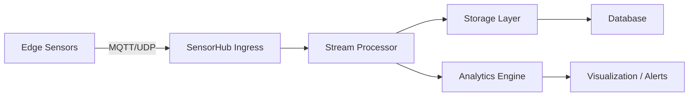

# SensorHub Study Guide

> *A quick-reference guide for getting up to speed with the SensorHub ecosystem, formatted for Obsidian integration.*

## Table of Contents
1. [Overview](#overview)  
2. [Core Concepts](#core-concepts)  
3. [System Architecture](#system-architecture)  
4. [Getting Started](#getting-started)  
5. [Common Tasks & Commands](#common-tasks--commands)  
6. [Best Practices](#best-practices)  
7. [Troubleshooting](#troubleshooting)  
8. [References & Further Reading](#references--further-reading)  

---

## Overview
SensorHub is a centralized platform for managing heterogeneous sensor data streams in AI-driven cyber‑physical systems. It provides:
- Real‑time ingestion from edge devices
- Unified metadata catalog
- Flexible data routing & transformation
- Built‑in analytics & visualization hooks

## Core Concepts
| Concept | Description |
|---------|-------------|
| **Sensor Node** | Physical or virtual device that publishes data to SensorHub. |
| **Data Stream** | Named channel for a specific sensor or data type. |
| **Handler** | Component that processes incoming data (e.g., parsing, validation). |
| **Sink** | Destination for processed data (e.g., database, dashboard). |

## System Architecture


## Getting Started
1. **Install SensorHub CLI**  
   ```bash
   curl -sSL https:// sensorhub.example.com/install.sh | sh
   ```
2. **Configure Access**  
   ```bash
   hub config set --endpoint https://sensorhub.example.com/api
   hub config set --auth-token $SENSORHUB_TOKEN
   ```
3. **Verify Connection**  
   ```bash
   hub ping
   ```

## Common Tasks & Commands
### List Available Streams
```bash
hub streams list
```

### Publish Test Message
```bash
hub stream publish /temperature --payload '{"value": 23.5}'
```

### Consume Stream (preview)
```bash
hub stream consume /temperature --count 5
```

### Configure a Handler
```bash
hub handler create temperature-processor --type python --script ./handlers/temp_processor.py
```

### Connect a Sink
```bash
hub sink attach temperature-processor --sink postgres://user:pass@db:5432/sensorhub
```

## Best Practices
- **Namespace streams** with a clear hierarchy (e.g., `/device-id/sensor-name`).  
- **Version your handler scripts**; use Git tags for rollback.  
- **Enable authentication** on all ingress endpoints.  
- **Monitor back‑pressure**: watch `hub metrics` for queue depth.  

## Troubleshooting
| Symptom | Likely Cause | Fix |
|---------|--------------|-----|
| No data received | Ingress endpoint unreachable | Check network/firewall; run `hub ping`. |
| Invalid payload format | Handler expects different schema | Update handler script or adjust publisher. |
| High latency | Queue buildup | Scale out processing resources; inspect `hub metrics`. |

## References & Further Reading
- **SensorHub Documentation** – https://sensorhub.example.com/docs  
- **Obsidian Plugin for SensorHub** – *SensorHub Notes* (install via Community Plugins).  
- **Related Skills** – `sensorhub-management`, `repo-code-management`.  

---

> **Tip for Obsidian Users**: Save this file in your Vault’s `SensorHub/` folder. Enable the *Backlinks* and *Graph View* to visualize connections between streams, handlers, and sinks.